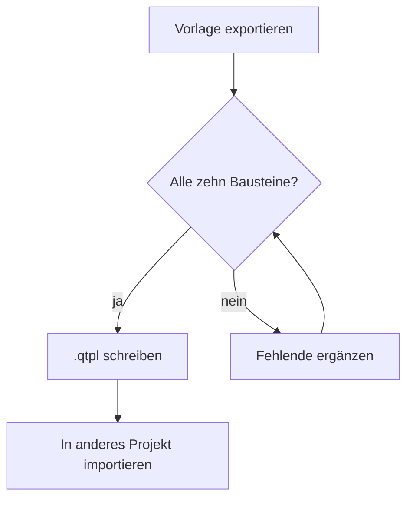
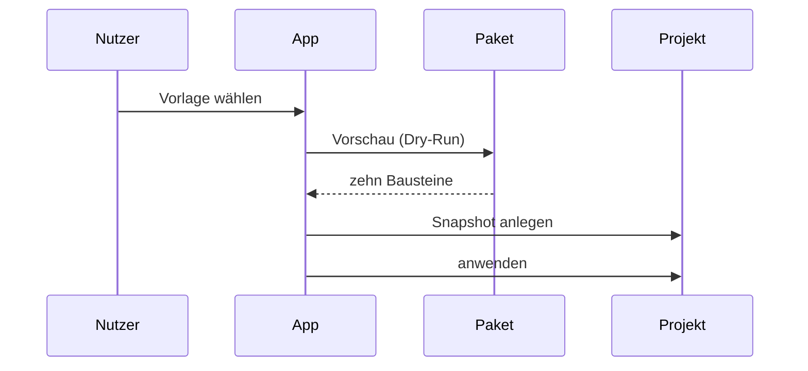
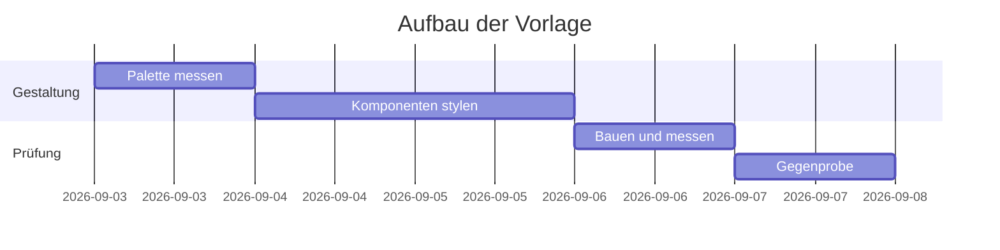
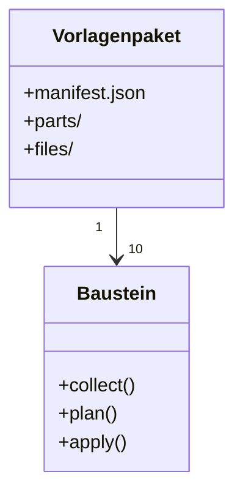

Mermaid ist Teil des Obsidian-Flavored-Markdown-Plugins und in dieser Vorlage aktiv. Die Diagramme
bringen ihre eigenen Farben mit; die Vorlage gestaltet den Kasten darum und lässt die Zeichnung in
Ruhe — ein halb umgefärbtes Diagramm ist schlechter als ein fremdfarbiges.

## Flussdiagramm

````md

````


## Sequenzdiagramm

````md

````


## Gantt



## Klassendiagramm


