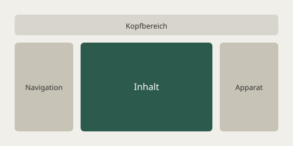

## Bild

```md

![[beispielbild.svg]]
```


Ein Bild bekommt in dieser Vorlage einen zarten Rahmen und runde Ecken. Ohne den Rahmen sieht ein
Bild mit weißem Hintergrund auf dem warmen Grund dieser Seite wie ein Loch aus.

> [!tip] Der Alternativtext ist nicht optional
> Was in den eckigen Klammern steht, wird vorgelesen, wenn das Bild nicht ankommt oder nicht
> gesehen wird. „Bild“ oder „Screenshot“ steht dort besser nicht — beschreibe, was zu sehen ist.

## Bild mit Größe

Obsidian erlaubt eine Breitenangabe hinter dem senkrechten Strich:

```md
![[beispiel.png|300]]

```

Die angegebene Breite bleibt erhalten; die Vorlage begrenzt nur nach oben auf die Spaltenbreite.

## Video

```md
![[video.mp4]]
<video src="/static/video.mp4" controls></video>
```

## Audio

```md
![[ton.mp3]]
<audio src="/static/ton.mp3" controls></audio>
```

## YouTube

```md

```

Die Einbettung behält das Seitenverhältnis 16:9. Ohne diese Regel fällt ein `iframe` in einer
Grid-Zelle auf null Höhe zusammen.

## Bild je nach Farbschema

Das Plugin *Layout Box* schaltet Bilder nach Farbschema um — ein Bild mit der Klasse `img-light`
erscheint im hellen Modus, `img-dark` im dunklen. Die Wortmarke oben links auf dieser Website
funktioniert so.

```html


```

> [!info] Was hier nicht gezeigt wird
> Excalidraw-Zeichnungen brauchen das Plugin *obsidian-plugin-excalidraw*, das in dieser Vorlage
> ausgeschaltet ist. Ein Beispiel dafür stünde hier als kaputte Einbettung — deshalb steht
> stattdessen dieser Hinweis.
